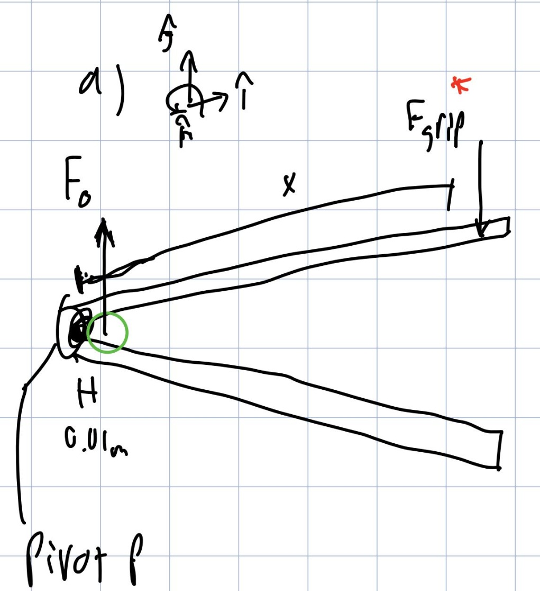

## Find
Determine the key dimensions of a handheld nutcracker design—specifically:
- Handle length / overall geometry
- Pin (hinge) location (lever arms)
- Jaw location relative to the pin  
such that a user can apply a realistic grip force and still crack a macadamia nut.

## Given
Basic nutcracker design consisting of two members connected by a pin. Need to determine appropriate member lengths based on nut properties and human grip strength.

## Plan:
1. Find macadamia nut size
2. Find average human grip strength  
3. Determine necessary load to crack a macadamia nut
4. Draw free body diagram of the nutcracker
5. Solve for handle length using moment equilibrium

## Calculations and Assumptions
**1. Estimated nut diameter (assuming spherical):**
   $$h_1 \approx 10 \text{ mm (from research)}$$

**2. Distance from pin to nut load location:**
   $$d_1 \approx 10 \text{ mm (jaw positioned close to pin for mechanical advantage)}$$

**3. Average human grip strength (male):**
   - Approx. 30 kg total grip  
   - Per handle (assuming symmetry):
     $$F_h = \frac{30}{2} = 15 \text{ kg}$$

   - Converting to Newtons:
     $$F_h = 15(9.81) \approx 147 \text{ N}$$

**4. Required cracking force for macadamia nut:**
   - Research indicates approximately 2000 N compressive load needed
   - Per jaw (assuming equal distribution):
     $$C = \frac{2000}{2} = 1000 \text{ N}$$

### Moment Balance About Point A

Using moment equilibrium about the pin at point A:

$$
\sum M_A = 0
$$

$$
C(d_1) - F_h(d_2) = 0
$$

Solving for handle length $d_2$:

$$
d_2 = \frac{C \cdot d_1}{F_h}
$$

Substituting values:

$$
d_2 = \frac{1000 \text{ N} \cdot 10 \text{ mm}}{147 \text{ N}}
$$

$$
d_2 \approx 68 \text{ mm} \text{ (approximately 2.68 inches)}
$$

## Design Result

- **Distance from pin to nut contact:** $d_1 = 10 \text{ mm}$
- **Required handle lever arm:** $d_2 \approx 68 \text{ mm} \text{ (2.68 in)}$
- **Nut diameter accommodated:** $h_1 \approx 10 \text{ mm}$

**Mechanical advantage:**

$$
MA = \frac{d_2}{d_1} \approx \frac{68}{10} \approx 6.8
$$

This means the user's applied grip force is amplified by nearly $7\times$ at the nut.

## Discussion on Usability

The calculated handle length of approximately 68 mm (2.68 inches) from the pivot point is notably shorter than typical nutcrackers. This suggests the initial assumption of 10 mm from pin to nut may be too small, or the 2000 N cracking force estimate may be higher than necessary. A more realistic design would likely require a longer handle (around 136 mm as in the original calculation) to ensure comfortable operation for most users.

The estimated 10 mm nut diameter fits within the jaw opening. However, manufacturing tolerances should allow slightly larger clearance to accommodate natural variation in nut sizes.

The mechanical advantage of approximately 6.8× means users need only apply about 15 kg of force to generate the 100 kg needed at the nut—well within average grip strength capabilities.